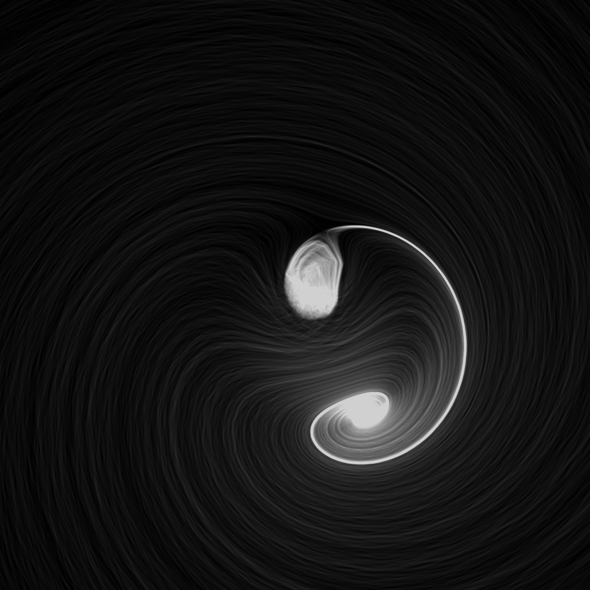
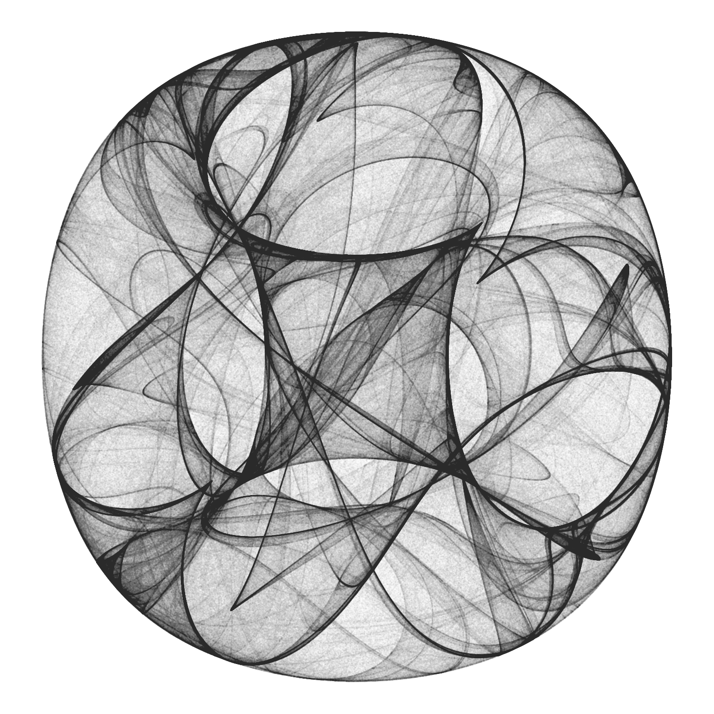
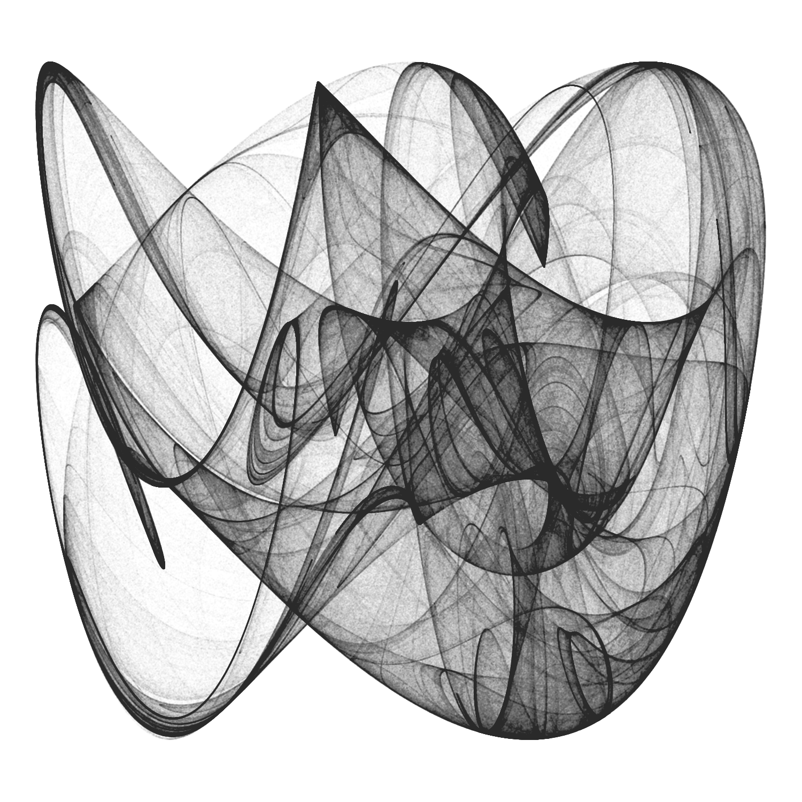
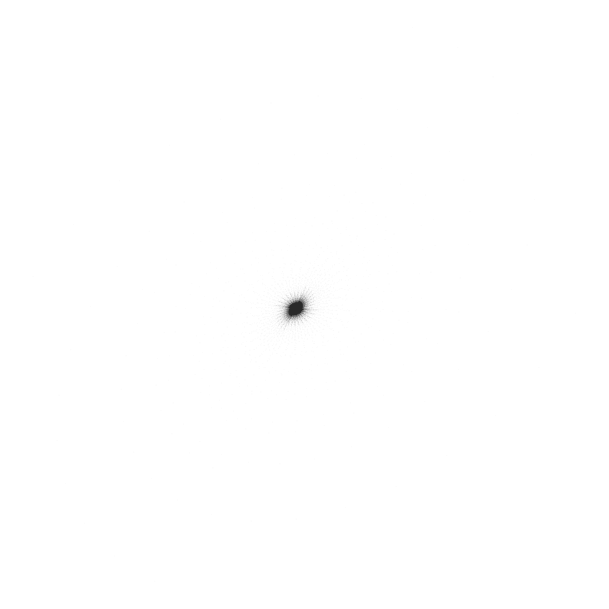
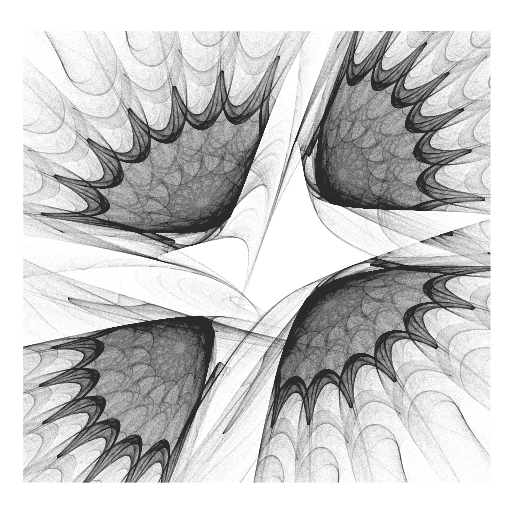
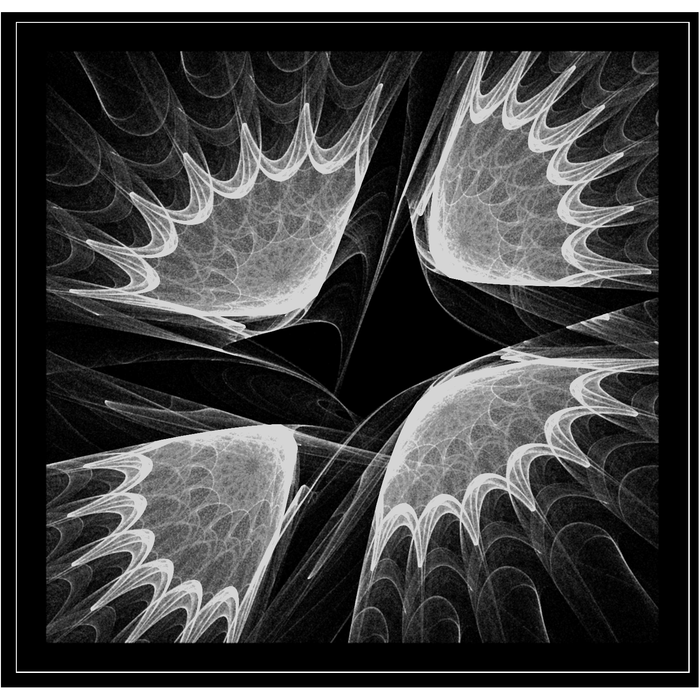

```{r, setup, include = FALSE}
knitr::opts_chunk$set(echo = TRUE)
```

Learning to code can be quite hard. Apart from the difficulties of learning a new *language*, following a book can be quite boring. From my point of view, one of the bests ways to become a good programmer is choosing *small and funny* experiments oriented to train specific techniques of programming. This is what I usually do in my blog [Fronkonstin](www.fronkonstin.com). In this tutorial, we will learn to combine C++ with R to create efficient loops. We will also learn interesting things about `ggplot2`, a very important package for data visualization. The *excuse* to do all this is to create beautiful images using a mathematical concept called *Strange Attractors*, that we will discuss briefly also. Combining art and coding is often called *generative art*, so be ready because after following this tutorial you can discover a new use of R to fall for as I am. Here we go!

## Introduction

Iteration is an indispensable technique in every programming language. Mastering it will help you to produce robust, fast, concise and easy to understand code. Iterating is repeating the same task over and over and the first way to do that efficiently is writing a *loop*, which is a way to resume many lines of code in just a few of them. In R, you can do this using the `for` function. For example, this loop calculates the mean of each column of a data frame called `df`:

```{r, warning = FALSE, message = FALSE}
library(tidyverse)

n <- 1000 # Rows of data frame

# df with 4 columns and n rows sampled from N(0,1)
df <- tibble(
  a = rnorm(n),
  b = rnorm(n),
  c = rnorm(n),
  d = rnorm(n)
)

output <- vector("double", ncol(df)) # Empty output
# For loop
for (i in 1:ncol(df)) {
  output[[i]] <- mean(df[[i]])
}
output
```

In the previous example, we repeated 4 times the task (which is the *piece* of code inside the curly brackets). Another way to do iterations in R, sometimes more efficient than a `for` loop, is by using the *apply* family. This is how the previous loop can be rewritten using the `apply` function:

```{r, eval = FALSE}
output <- apply(df, 2, mean)
output
```

These approaches have limitations. For example, if you want to use the result of an iteration as the input of the next one, you can not use *apply*. Another one is that sometimes R is not enough fast, which makes the `for` function quite inefficient. When you face this kind of situations, a good option is combinnig C++ and R. To illustrate this, let's briefly introduce a stunning mathematical *creature*: the strange attractors.

## What are strange attractors?

In mathematics, a dynamical system is a set of functions which  describes the time dependence of a point in a geometrical space. An attractor is a set of numerical values towards a dynamical system tend to evolve in discrete time regardless of their starting conditions. Simple attractors can be **fixed points**, **sets of points** or **limit cycles**. More interesting attractors are *strange*, *chaotic* or *itinerant* attractors, which span an array of possible states in which a dynamical system can roam around without repeating itself.

One of the best-known examples of strange attractors was discovered by Kiyohiro Ikeda [^1] and bears his name. It is defined by the next equations:

[^1]: K.Ikeda, Multiple-valued Stationary State and its Instability of the Transmitted Light by a Ring Cavity System, Opt. Commun. 30 257-261 (1979); K. Ikeda, H. Daido and O. Akimoto, Optical Turbulence: Chaotic Behavior of Transmitted Light from a Ring Cavity, Phys. Rev. Lett. 45, 709–712 (1980)

$x_{n+1}=1+u(x_{n}\cos t_{n}-y_{n}\sin t_{n})
\\
y_{n+1}=u(x_{n}\sin t_{n}+y_{n}\cos t_{n})$

with $u\ge0.6$ and 

$t_{n}=0.4-{\frac {6}{1+x_{n}^{2}+y_{n}^{2}}}$

In this example, our *imaginary* point moves in a 2D dimensional space, since we just need `(x, y)` coordinates to describe its movement. In the previous system, time is represented by `n`. As you can see, the Ikeda's system only depends on one parameter, called `u`. The location of the point at `n` depends only on its location at `n-1`. For example, this image [^2] shows the trajectories of 2000 random points following this previous equation with $u = 0.918$:

<center>
{width=412px}
</center>

[^2]: Accelerometer [CC BY-SA 3.0](https://creativecommons.org/licenses/by-sa/3.0)

All points, regardless of their starting place, tend to end following the same path, represented in bright white color. Another interesting property of strange attractors is that points that are very close at some instant, can differ significantly in the next step. This is why strange attractors are also known as *chaotic* attractors. 

Today we will experiment with Clifford attractors, which are defined by these equations:

$x_{n+1} = sin(a \: y_{n}) + c \: cos(a \: x_{n})
\\
y_{n+1} = sin(b \: x_{n}) + d \: cos(b \: y_{n})$

These attractors were discovered by [Clifford Pickover](https://en.wikipedia.org/wiki/Clifford_A._Pickover), an american scientific divulgator and depend on four parameters; `a`, `b`, `c` and `d`.

## Populating attractors: an inefficient approach

To represent the trajectory of a particular point, we need to store in a data frame its locations at every single (discrete) moment of time. For example, this is how we can do it using a `for` loop:

```{r, warning = FALSE, message = FALSE}

# Parameters setting
a <- -1.25
b <- -1.25
c <- -1.82
d <- -1.91

# Number of jumps
n <- 5

# Initialization of df to store locations of point
df <- data.frame(x = double(n+1), y = double(n+1))

# The point starts at (0,0)
df[1, "x"] <- 0
df[1, "y"] <- 0

# For loop to store locations
for (i in 1:n) {
  df[i+1, "x"] <- sin(a*df[i, "y"])+c*cos(a*df[i, "x"])
  df[i+1, "y"] <- sin(b*df[i, "x"])+d*cos(b*df[i, "y"])
}

df
```

As you can see, our point started at `(0,0)` and *jumped* 5 times (the number of jumps is represented by `n`). You can try to change `n` from `5` to `10000000` and see what happens (disclaimer: be patient).

A better approach to do it is using `purrr`, a functional programming package which provides useful tools for iterating through lists and vectors, generalizing code and removing programming redundancies. The `purrr` tools work in combination with functions, lists and vectors and results in code that is consistent and concise. This can be a `purrr` approach to our problem:

```{r, warning = FALSE, message = FALSE}
library(purrrlyr)

n <- 5

# Initialization of our data frame
df <- tibble(x = numeric(n+1),
             y = numeric(n+1))

# Convert our data frame into a list
by_row(df, function(v) list(v)[[1L]], .collate = "list")$.out -> df

# This function computes current location depending of previous one
f <- function(j, k, a, b, c, d) {
  tibble(
    x = sin(a*j$y)+c*cos(a*j$x),
    y = sin(b*j$x)+d*cos(b*j$y)
  )
}

# We apply accumulate on our list to store all steps and convert into a data frame
accumulate(df, f, a, b, c, d) %>% map_df(~ .x) -> df

df
```

Even this approach is not efficient since the `accumulate` function must be applied on an existing object (the `df` in our case)

## Combining C++ and R: the good way

The next paragraph, extracted from Hadley Wickham's [Advanced R](https://adv-r.hadley.nz/rcpp.html), explains the motivations of combining C++ and R:

`Rcpp` makes it very simple to connect C++ to R and provides a clean, approachable API that lets you write high-performance code, insulated from R’s complex C API. Typical bottlenecks that C++ can address include:

+ Loops that can’t be easily vectorised because subsequent iterations depend on previous ones.

+ Recursive functions, or problems which involve calling functions millions of times. The overhead of calling a function in C++ is much lower than in R.

+ Problems that require advanced data structures and algorithms that R doesn’t provide. Through the standard template library (STL), C++ has efficient implementations of many important data structures, from ordered maps to double-ended queues.

This code populates our data frame using C++:

```{r, warning = FALSE, message = FALSE}

# Load in libaries
library(Rcpp)
library(tidyverse)

# Here comes the C++ code
cppFunction('DataFrame createTrajectory(int n, double x0, double y0,
            double a, double b, double c, double d) {
            // create the columns
            NumericVector x(n);
            NumericVector y(n);
            x[0]=x0;
            y[0]=y0;
            for(int i = 1; i < n; ++i) {
            x[i] = sin(a*y[i-1])+c*cos(a*x[i-1]);
            y[i] = sin(b*x[i-1])+d*cos(b*y[i-1]);
            }
            // return a new data frame
            return DataFrame::create(_["x"]= x, _["y"]= y);
            }
            ')

a <- -1.25
b <- -1.25
c <- -1.82
d <- -1.91

# Call the function starting at (0,0) to store 10M jumps
df <- createTrajectory(10000000, 0, 0, a, b, c, d)

head(df)
```

Note that, apart from `Rcpp`,  we also loaded the tidyverse package. This is because we will use some of its features, as `dplyr` or `ggplot2`, later. 

The function `createTrajectory` is written in `C++` and stores the itinerary of an initial point. You can try it to see that It's extremely fast. In the previous example, I populated on the fly our data frame with 10 million points starting at `(0,0)` in less than 5 seconds in a conventional laptop.

## Rendering the plot with ggplot

Once we have built our data frame, it's time to represent it with `ggplot`. 

Making graphics is a necessary skill and for this `ggplot` is an amazing tool, which by
the way, I encourage you to learn. Usually, a good visualization is the best way to show your results. R is an extraordinary tool for visualizing data and one of the most important libraries to do it is `ggplot2`: it is powerful, flexible and is updated to include functionalities regularly. Although its syntax may seem a bit strange at first, here are four important concepts from my point of view to help you out with understanding it:

+ It’s truly important to have clear the type of graph you want to plot: for each one there’s a different *geometry*: `geom_point` to represent points, `geom_line` to represent time series, `geom_bar` to do bar chars ... Have a look to `ggplot2` package, there are many other types.
+ Each of those geometries needs to define what data is to be used and how. For example, as you will see in our graph, we placed on the x-axis the `x` column of our data frame `df` and `y` on the y-axis, so we did `aes(x = x, y = y)`.
+ You can also combine geometries. We didn’t do that for our example but you may want, for example, to combine bars and lines on the same plot. To do it you can just use `+` operator. This operator is very important: it doesn’t only combine geometries, it’s also used to add features to the plot as we did to define its aspect ratio (with `coord_equal`) or its appearance (with `theme_void`).
+ You can modify every detail of the look and feel of your graph but be patient. To begin with, I recommend the use of predefined themes as I did with `theme_void`. There are many of them and it’s is a *quick and easy* way to change the appearance of your plot: just a way of making life easier and simpler.

The `ggplot2` package is a new world by itself and takes part of the `tidyverse`, a collection of efficient libraries designed to analyze data in a consistent way.

This is how we can represent the points of our data frame:

```{r, eval = FALSE}

ggplot(df, aes(x = x, y = y)) +
  geom_point(shape = 46, alpha = .01) +
  coord_equal() +
  theme_void() -> plot

ggsave("strange1.png", plot, height = 5, width = 5, units = 'in')

```

<center>
{width=450px}
</center>


The syntax of our plot is quite simple. Just two comments about it:
+  shape is set to 46, the smallest filled point. More info about shapes, [here](http://sape.inf.usi.ch/quick-reference/ggplot2/shape)
+ Since there are a lot of points, I make them transparent with alpha to take advantage on its overlapping and reveal patterns of shadows.


## Playing with parameters

Strange attractors are extremely sensitive to their parameters. This feature makes them very entertaining as well as an infinite source of surprises. This is what happens to Clifford attractor when setting `a`, `b`, `c` and `d` parameters to `-1.2`, `-1.9`, `1.8` and `-1.6` respectively:

```{r, eval = FALSE}
a <- -1.2
b <- -1.9
c <- 1.8
d <- -1.6

df <- createTrajectory(10000000, 0, 0, a, b, c, d)

ggplot(df, aes(x = x, y = y)) +
  geom_point(shape = 46, alpha = .01) +
  coord_equal() +
  theme_void() -> plot

ggsave("strange2.png", plot, height = 5, width = 5, units = 'in')

```

<center>
{width=450px}
</center>

Don't you feel like playing with parameters? From my point of view, this is a *very classy* way of spending your time.

## The General 2D-Map

Once we know what strange attractors *look like*, let's try another family of them. This is the new formula we will experiment with:

$x_{n+1} = a_{1} + a_{2}x_{n} + a_{3}y_{n} + a_{4}|x_{n}|^{a_{5}} + a_{6}|y_{n}|^{a_{7}}
\\
y_{n+1} = a_{8} + a_{9}x_{n} + a_{10}y_{n} + a_{11}|x_{n}|^{a_{12}} + a_{13}|y_{n}|^{a_{14}}$

These attractors are localized mostly to a small region of the XY plane with *tentacles* that stretch out to large distances. If any of the exponents are negative and the attractor intersects the line along which the respective variable is zero, a point on the line maps to infinity. However, large values are visited infrequently by the orbit, so many iterations are required to determine that the orbit is unbounded. For this reason most of the attractors in the figures have holes in their interiors where their orbits are precluded from coming too close to their origins.


```{r, eval = FALSE}
cppFunction('DataFrame createTrajectory(int n, double x0, double y0,
            double a1, double a2, double a3, double a4, double a5,
            double a6, double a7, double a8, double a9, double a10,
            double a11, double a12, double a13, double a14) {
            // create the columns
            NumericVector x(n);
            NumericVector y(n);
            x[0]=x0;
            y[0]=y0;
            for(int i = 1; i < n; ++i) {
            x[i] = a1+a2*x[i-1]+ a3*y[i-1]+ a4*pow(fabs(x[i-1]), a5)+ a6*pow(fabs(y[i-1]), a7);
            y[i] = a8+a9*x[i-1]+ a10*y[i-1]+ a11*pow(fabs(x[i-1]), a12)+ a13*pow(fabs(y[i-1]), a14);
            }
            // return a new data frame
            return DataFrame::create(_["x"]= x, _["y"]= y);
            }
            ')
a1 <- -0.8
a2 <- 0.4
a3 <- -1.1
a4 <- 0.5
a5 <- -0.6
a6 <- -0.1
a7 <- -0.5
a8 <- 0.8
a9 <- 1.0
a10 <- -0.3
a11 <- -0.6
a12 <- -0.3
a13 <- -1.2
a14 <- -0.3

df <- createTrajectory(10000000, 1, 1, a1, a2, a3, a4, a5, a6,
                       a7, a8, a9, a10, a11, a12, a13, a14)

ggplot(df) +
  geom_point(aes(x = x, y = y), shape = 46, alpha = .01, color = "black") +
  coord_fixed() +
  theme_void() -> plot

ggsave("strange3.png", plot, height = 5, width = 5, units = 'in')

```


<center>
{width=450px}
</center>

Ops! What happened? Why our image is so small now? The reason is because some few points are located quite far from the vast majority (you can think about them as *outliers*). Let's remove 5% of extreme points from both tails independently:

```{r, eval = FALSE}
mx <- quantile(df$x, probs = 0.05)
Mx <- quantile(df$x, probs = 0.95)
my <- quantile(df$y, probs = 0.05)
My <- quantile(df$y, probs = 0.95)

df %>% filter(x > mx, x < Mx, y > my, y < My) -> df

ggplot(df) +
  geom_point(aes(x = x, y = y), shape = 46, alpha = .01, color = "black") +
  coord_fixed() +
  theme_void() -> plot

ggsave("strange3.png", plot, height = 5, width = 5, units = 'in')

```


<center>
{width=450px}
</center>

Now a stunning image appears. 

Sometimes you will need to process the data frame after you generate it since:

+ Extreme values can hide the pattern as happened before or even *scape* to infinite (solution: remove outliers).
+ Some images can be quite *boring*: from my point of view, the more *distributed* ae points on the XY plane, the nicer is the resulting image (solution: try with a small data frame and keep it if some measure of dispersion over the plane or the individual axis is high enough; in this case, compute the big picture).

To conclude, let's change the appearance of our plot. We will use the `theme` function to customize it setting the background color to black and adding a white line as frame. 

```{r, eval = FALSE}

opt <-  theme(legend.position  = "none",
              panel.background = element_rect(fill="black", color="white"),
              plot.background  = element_rect(fill="black"),
              axis.ticks       = element_blank(),
              panel.grid       = element_blank(),
              axis.title       = element_blank(),
              axis.text        = element_blank())

plot <- ggplot(df) +
  geom_point(aes(x = x, y = y), shape = 46, alpha = .01, color = "white") +
  coord_fixed() +
  opt

ggsave("strange4.png", plot, height = 5, width = 5, units = 'in')
```
<center>
{width=450px}
</center>


## Summary

## Further reading

More about recursivity and `ggplot`:

- Hadley's [R for Data Science](https://r4ds.had.co.nz/iteration.html) and [Advanced R](https://adv-r.hadley.nz/rcpp.html): the first one covers iteration methods (including functional ones) as well as `ggplot` and the second one introduces `Rcpp` to use C++ when R is not fast enough. 

More about strange attractors:

- [Strange Attractors: Creating Patterns in Chaos](http://sprott.physics.wisc.edu/sa.htm), by Julien C. Sprott: a beautiful book which describes a big amount of different attractors including equations and examples of their patterns.
