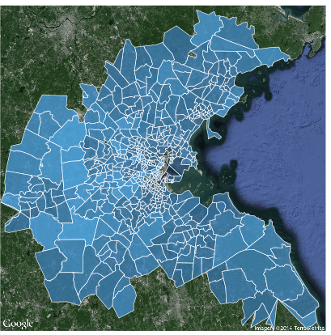

## Outline

* Intro to Bayesian Inference

* Intro to INLA and R-INLA

* Intro to the analysis of lattice data

* Models for lattice data

* Analysis of lattice data with INLA


## Bayesian inference

* Fitting a Bayesian model means computing $\pi(\theta, \mathbf{x} \mid y)$

$$
\pi(\theta, \mathbf{x} \mid y)  \propto \pi(y \mid \theta, \mathbf{x})\pi(\theta)
$$

* $\theta$ contains all parameters in the model and $\mathbf{x}$ represents the
latent effects

* For example, we could compute posterior probabilities of linear
predictors, random effects, sums of random effects, etc.

* Depending on the likelihood and the prior distribution computing
$\pi(\theta, \mathbf{x} \mid y)$ can be very difficult

* In the last 20-30 years some computational approaches have been proposed
to estimate $\pi(\theta, \mathbf{x} \mid y)$ with Monte Carlo methods


## Inference with MCMC


* MCMC provides simulations from the ensemble of model parameters, i.e., a
multivariate distribution

* This will allow us to estimate the joint posterior distribution

* However, we may be interested in a single parameter or a subset of
the parameters

* Inference for this subset of parameters can be done by simply ignoring
the samples for the other parameters

* Using the samples it is possible to compute the posterior distribution
of any function on the model parameters

* MCMC may require lots of simulations for valid inference

* Also, we must check that the burn-in period has ended, i.e., we have
reached the posterior distribution


## Integrated Nested Laplace Approximation

* *Sometimes we only need marginal inference on some parameters, i.e., we
need $\pi(\theta_i \mid y)$*

*  Rue et al. (2009) propose a way of approximating
the marginal distributions

* Now we are dealing with (many) univariate
distributions

* This is computationally faster because numerical integration techniques
are used instead of Monte Carlo sampling


## Integrated Nested Laplace Approximation


The marginal distributions for the latent effects and hyper-parameters can be
written as


$$
\pi(x_i \mid \mathbf{y}) = \int \pi(x_i \mid \mathbf{\theta}, \mathbf{y})  \pi(\mathbf{\theta}\mid \mathbf{y}) d\mathbf{\theta}
$$
\noindent
and

$$
\pi(\theta_j\mid \mathbf{y}) = \int \pi(\mathbf{\theta}\mid  \mathbf{y})  d\mathbf{\theta}_{-j} 
$$

The posterior distribution of the hyperparameters $\pi(\mathbf{\theta}\mid  \mathbf{y})$ is approximated using different methods.


## R-INLA package 

* Available from [http://www.r-inla.org](http://www.r-inla.org)

* Implementation of INLA as an R package

* `inla()`-function similar to `glm()`

* Model is defined in a \code{formula}

* Flexible way of defining:

    +  Likelihood

    + Prior

    + Latent effects


## R-INLA package

* Provides marginals of:

    + Model parameters

    + Linear predictor

    + Linear combinations of model parameters

* Tools to manipulate $\pi(\cdot \mid y)$ to compute $\pi(f(\cdot) \mid y)$

* Model assessment/choice: Marginal likelihood, DIC, CPO, ...


## Spatial latent effects {.smaller}


  Name in `f()`     Model
----------------  --------
  `generic0`        $\Sigma=\frac{1}{\tau}Q^{-1}$
  `generic1`        $\Sigma=\frac{1}{\tau}(I_n-\frac{\rho}{\lambda_{max}}C)^{-1}$
  `besag`           Intrinsic CAR
  `besagproper`     Proper CAR
  `bym`             Convolution model
  `rw2d`            Random walk 2-D
  `matern2d`        Matèrn correlation (discrete)
  `slm`             Spatial lag model
  `spde`            Matèrn correlation (continuous)

Table: Summary of latent effects.


## Dataset: Leukemia in upstate New York

* Data from `DClusterm` package

* Described in Waller and Gotway (2004)

* `Cases`: Number of leukemia cases

* `POP8`: Population in 1980

* `AVGIDIST`: Average inverse distance to the nearest TCE site.

* Other socio-economic covariates are often taken into account (but they will
not be considered here)

* Plots of Syracuse city (to save space)

## Dataset: Leukemia in upstate New York


```{r  message = FALSE, results = "hide"}
library(spdep)
library(DClusterm)
data(NY8)

rate <- sum(NY8$Cases) / sum(NY8$POP8)
NY8$Expected <- NY8$POP8 * rate
NY8$SMR <- NY8$Cases / NY8$Expected

# Subset Syracuse city
syracuse <- which(NY8$AREANAME == "Syracuse city")
```


## Standardised Mortality Ratio ($O_i/E_i)$

```{r fig = TRUE, echo = FALSE}
spplot(NY8[syracuse, ], "SMR", at=c(0.6, 0.9801, 1.055, 1.087, 1.125, 1.6),
   col.regions=gray.colors(5, 0.9, 0.4))
```

## Standardised Mortality Ratio ($O_i/E_i)$

```{r eval = FALSE}
library(tmap)
tmap_mode("view")

SMR_map <- tm_shape(NY8[syracuse, ]) +
  tm_fill(col = "SMR", alpha = 0.35) +
  tm_borders() +
  tm_shape(TCE) + tm_dots(col = "red")
SMR_map
```


## Standardised Mortality Ratio ($O_i/E_i)$

```{r eval = TRUE, echo = FALSE, message = FALSE, warning = FALSE}
library(tmap)
tmap_mode("view")

SMR_map <- tm_shape(NY8[syracuse, ]) +
  tm_fill(col = "SMR", alpha = 0.35) +
  tm_borders() +
  tm_shape(TCE) + tm_dots(col = "red")
SMR_map
```


## Example: Mixed-effects models

### Poisson regression


$$
O_i|\mu_i \sim Po(\mu_i)
$$

$$
\mu_i = E_i \theta_i 
$$

$$
\log(\theta_i) = \alpha + \beta AVGIDIST_i
$$


```{r message = FALSE, results = "hide"}
library(INLA)
m1 <- inla(Cases ~ 1 + AVGIDIST, data = as.data.frame(NY8),
  family = "poisson",
  E = NY8$Expected, control.predictor = list(compute = TRUE),
  control.compute = list(dic = TRUE, waic = TRUE))

```

## Example: Mixed-effects models {.smaller}

```{r echo = FALSE}
summary(m1)
```

## Example: Mixed-effects models

### Poisson regression with random effects


$$
O_i|\mu_i \sim Po(\mu_i)
$$

$$
\mu_i = E_i \theta_i 
$$

$$
\log(\theta_i) = \alpha + \beta AVGIDIST_i + u_i
$$

$$
u_i \sim N(0, \tau)
$$


```{r messages = FALSE}
NY8$ID <- 1:nrow(NY8)
m2 <- inla(Cases ~ 1 + AVGIDIST + f(ID, model = "iid"), 
  data = as.data.frame(NY8), family = "poisson", 
  E = NY8$Expected,
  control.predictor = list(compute = TRUE),
  control.compute = list(dic = TRUE, waic = TRUE))
```

## Example: Mixed-effects models {.smaller}

```{r echo = FALSE}
summary(m2)
```


## Example: Mixed-effects models

### Add estimates to map

```{r}
NY8$FIXED.EFF <- m1$summary.fitted[, "mean"]
NY8$IID.EFF <- m2$summary.fitted[, "mean"]
```

```{r echo = FALSE, fig = TRUE, fig.width = 8, fig.height = 4}
spplot(NY8[syracuse, ], c("SMR", "FIXED.EFF", "IID.EFF"))
```


## Spatial Models for Lattice Data


<div class="columns-2">


* Lattice data involves data measured at different areas, e.g.,
neighbourhoods, cities, provinces, states, etc.

* Spatial dependence appears because neighbour areas will show similar
values of the variable of interest

</div>


## Models for lattice data

* We have observations $y=\{y_i\}_{i=1}^n$ from the $n$ areas

* $y$ is assigned a multivariate distribution that *accounts
for spatial dependence*

* A common way of describing spatial proximity in lattice data
is by means of an *adjacency matrix* $W$

* $W[i,j]$ is non-zero if areas $i$ and $j$ are neighbours

* Usually, two areas are neighbours if the share a common boundary

* There are other definitions of neighbourhood


## Example: Adjacency matrix

```{r fig = TRUE, eval = TRUE}
NY8.nb <- poly2nb(NY8)
plot(NY8) 
plot(NY8.nb, coordinates(NY8), add = TRUE, pch = ".", col = "gray")
```

## Regression models


* It is often the case that, in addition to $y_i$, we have a number
of covariates $x_i$

* Hence, we may want to *regress $y_i$ on $x_i$*

* In addition to the covariates we may want to *account for
the spatial structure of the data*

* Different types of regression models can be used to model lattice data:


    +  Generalized Linear Models (with spatial random effects)

    + Spatial econometrics models


* *Generalized Linear Mixed Models are often used*


## Linear Mixed Models

* A common approach (for Gaussian data) is to use a linear
regression with random effects

$$
Y =  X \beta+ Zu +\varepsilon 
$$


* The vector random effects $u$ is modelled as a MVN:

$$
u \sim N(0, \sigma^2_u \Sigma)
$$

* *$\Sigma$ is defined such as it induces higher correlation with adjacent  areas*

* $Z$ is a design matrix for the random effects

* $\varepsilon_i \sim N(0, \sigma^2), i=1, \ldots, n$: error term


*  *Similarly for Generalised Linear Mixed Models*


## Structure of spatial random effects

There are many different ways of including spatial dependence
in $\Sigma$:


* *Simultaneous autoregressive (SAR):*

$$
\Sigma^{-1} = [(I-\rho W)' (I-\rho W)]
$$

* *Conditional autoregressive (CAR):*

$$
\Sigma^{-1} = (I-\rho W)
$$

* *Intrinsic CAR (ICAR):*

  $$
  \Sigma^{-1} = diag(n_i) - W
  $$

  $n_i$ is the number of neighbours of area $i$.

## Structure of spatial random effects

There are many different ways of including spatial dependence
in $\Sigma$:


* $\Sigma_{i,j}$ depends on  a function of $d(i,j)$. For example:

$$
\Sigma_{i,j} = \exp\{-d(i,j)/\phi\}
$$

* 'Mixture' of matrices (Leroux et al.'s model):

  $$
  \Sigma = [(1 - \lambda) I_n + \lambda M]^{-1};\ \lambda \in (0,1)
  $$

  $M$ precision of instrinsic CAR specification


## Example: ICAR model 

```{r}
NY8.mat <- as(nb2mat(NY8.nb, style = "B"), "Matrix")
m.icar <- inla(Cases ~ 1 +  AVGIDIST + 
    f(ID, model = "besag", graph = NY8.mat),
  data = as.data.frame(NY8), E = NY8$Expected, family ="poisson",
  control.predictor = list(compute = TRUE),
  control.compute = list(dic = TRUE, waic = TRUE))
```

## Example: ICAR model {.smaller}

```{r echo = FALSE}
summary(m.icar)
```


## Example: BYM model

```{r}
m.bym = inla(Cases ~ 1 +  AVGIDIST + 
    f(ID, model = "bym", graph = NY8.mat),
  data = as.data.frame(NY8), E = NY8$Expected, family ="poisson",
  control.predictor = list(compute = TRUE),
  control.compute = list(dic = TRUE, waic = TRUE))
```

The linear predictor $\eta_i$ is:

$$
\eta_i = \alpha + \beta AVGIDIST_i + u_i + v_i
$$

* $u_i$ is an i.i.d. Gaussian random effect

* $v_i$ is an intrinsic CAR random effect

## Example: BYM model  {.smaller}

```{r echo = FALSE}
summary(m.bym)
```


## Example: Leroux et al. model

* 'Mixture' of matrices (Leroux et al.'s model):

  $$
  \Sigma^{-1} = [(1 - \lambda) I_n + \lambda M];\ \lambda \in (0,1)
  $$

  $M$ precision of instrinsic CAR specification

* This model is implemented using the `generic1` latent effect:

$$
\Sigma^{-1} = \frac{1}{\tau}(I_n-\frac{\rho}{\lambda_{max}}C); \rho \in [0,1)
$$

* Take

$$
C = I_n - M;\ M = diag(n_i) - W
$$

## Example: Leroux et al. model

* Then, $\lambda_{max} = 1$ and

$$
\Sigma^{-1} = 
\frac{1}{\tau}(I_n-\frac{\rho}{\lambda_{max}}C) = 
  \frac{1}{\tau}(I_n-\rho(I_n - M)) = 
$$

$$
= (1-\rho) I_n + \rho M
$$


## Example: Leroux et al. model

Create matrix $M$:

```{r}
ICARmatrix <- Diagonal(nrow(NY8.mat), apply(NY8.mat, 1, sum)) - NY8.mat
Cmatrix <- Diagonal(nrow(NY8), 1) -  ICARmatrix
```

Check the value of $\lambda_{max}$:

```{r}
max(eigen(Cmatrix)$values)
```

## Example: Leroux et al. model

```{r}
m.ler = inla(Cases ~ 1 +  AVGIDIST +
    f(ID, model = "generic1", Cmatrix = Cmatrix),
  data = as.data.frame(NY8), E = NY8$Expected, family ="poisson",
  control.predictor = list(compute = TRUE),
  control.compute = list(dic = TRUE, waic = TRUE))
```

## Example: Leroux et al. model  {.smaller}

```{r, echo = FALSE}
summary(m.ler)
```


## Spatial Econometrics Models

* Slightly different approach to spatial modelling

* Instead of using latent effects, spatial dependence is modelled explicitly

* Autoregressive models are used to make the response variable to depend on the values at its neighbours


## Simultaneous Autoregresive Model (SEM)

* This model includes covariates

* Autoregressive on the **error term**


$$
y= X \beta+u; u=\rho Wu+e; e\sim N(0, \sigma^2)
$$

$$
y= X \beta + \varepsilon; \varepsilon\sim N(0, \sigma^2 (I-\rho W)^{-1} (I-\rho W')^{-1})
$$


## Spatial Lag Model (SLM)

* This model includes covariates

* Autoregressive on the **response**


$$
y = \rho W y + X \beta + e; e\sim N(0, \sigma^2)
$$

$$
y = (I-\rho W)^{-1}X\beta+\varepsilon;\ \varepsilon \sim N(0, \sigma^2(I-\rho W)^{-1} (I-\rho W')^{-1})
$$


## New `slm` Latent Class 

* `R-INLA` includes now a new latent effect:

$$
\mathbf{x}= (I_n-\rho W)^{-1} (X\beta +e)
$$

* $W$ is a row-standardised adjacency matrix

* $\rho$ is a spatial autocorrelation parameter

* $X$ is a matrix of covariates, with coefficients $\beta$

* $e$ are Gaussian i.i.d. errors with variance $\sigma^2$


* The `slm` latent effect is **experimental**

* It can be combined with other effects in the linear predictor

## New `slm` Latent Class


* **SEM**

$$
y= X \beta + (I-\rho W)^{-1} (0+e);\ e \sim N(0, \sigma^2 I)
$$

* **SLM**

$$
y = (I-\rho W)^{-1}(X\beta+e);\ e \sim N(0, \sigma^2 I)
$$


## New `slm` Latent Class

In order to define a model, we need:

* `X`: Matrix of covariates

* `W` **Row-standardised** adjacency matrix

* `Q`: Precision matrix of coefficients  $\beta$

* Range of $\rho$, often defined by the eigenvalues

## Example: `slm` model

```{r}
#X
mmatrix <- model.matrix(Cases ~ 1 + AVGIDIST, NY8)

#W
W <- as(nb2mat(NY8.nb, style = "W"), "Matrix")

#Q
Q.beta = Diagonal(n = ncol(mmatrix), x = 0.001)

#Range of rho
rho.min<- -1
rho.max<- 1
```


## Example: `slm` model

```{r}
#Arguments for 'slm'
args.slm = list(
   rho.min = rho.min ,
   rho.max = rho.max,
   W = W,
   X = mmatrix,
   Q.beta = Q.beta
)

#Prior on rho
hyper.slm = list(
   prec = list(
      prior = "loggamma", param = c(0.01, 0.01)),
      rho = list(initial=0, prior = "logitbeta", param = c(1,1))
)

```

## Example: `slm` model

```{r}
#SLM model
m.slm <- inla( Cases ~ -1 +
     f(ID, model = "slm", args.slm = args.slm, hyper = hyper.slm),
   data = as.data.frame(NY8), family = "poisson",
   E = NY8$Expected,
   control.predictor = list(compute = TRUE),
   control.compute = list(dic = TRUE, waic = TRUE)
)

```

## Example: `slm` model  {.smaller}

```{r echo = FALSE}
summary(m.slm)
```


## Example: `slm` model

Estimates of the coefficients appear as part of the random effects:

```{r}
round(m.slm$summary.random$ID[47:48,], 4)
```

## Example: `slm` model

Spatial autocorrelation is reported in the internal scale (i.e., between
0 and 1) and needs to be re-scaled:

```{r}
marg.rho.internal <- m.slm$marginals.hyperpar[["Rho for ID"]]
marg.rho <- inla.tmarginal( function(x) {
  rho.min + x * (rho.max - rho.min)
}, marg.rho.internal)

inla.zmarginal(marg.rho, FALSE)

```

## Example: `slm` model

Spatial autocorrelation is reported in the internal scale (i.e., between
0 and 1) and needs to be re-scaled:

```{r fig = TRUE, echo = FALSE}
plot(marg.rho, type = "l", main = "Spatial autocorrelation")

```


## Example: Summary of results


```{r}
NY8$ICAR <- m.icar$summary.fitted.values[, "mean"]
NY8$BYM <- m.bym$summary.fitted.values[, "mean"]
NY8$LEROUX <- m.ler$summary.fitted.values[, "mean"]
NY8$SLM <- m.slm$summary.fitted.values[, "mean"]
```

## Example: Summary of results

```{r fig = TRUE, echo = FALSE}
spplot(NY8[syracuse, ], c("SMR", "FIXED.EFF", "IID.EFF", "ICAR", "BYM", "LEROUX", "SLM"))
```

