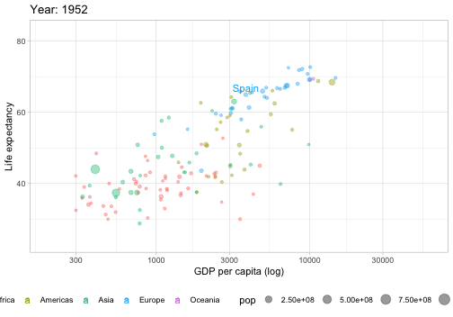
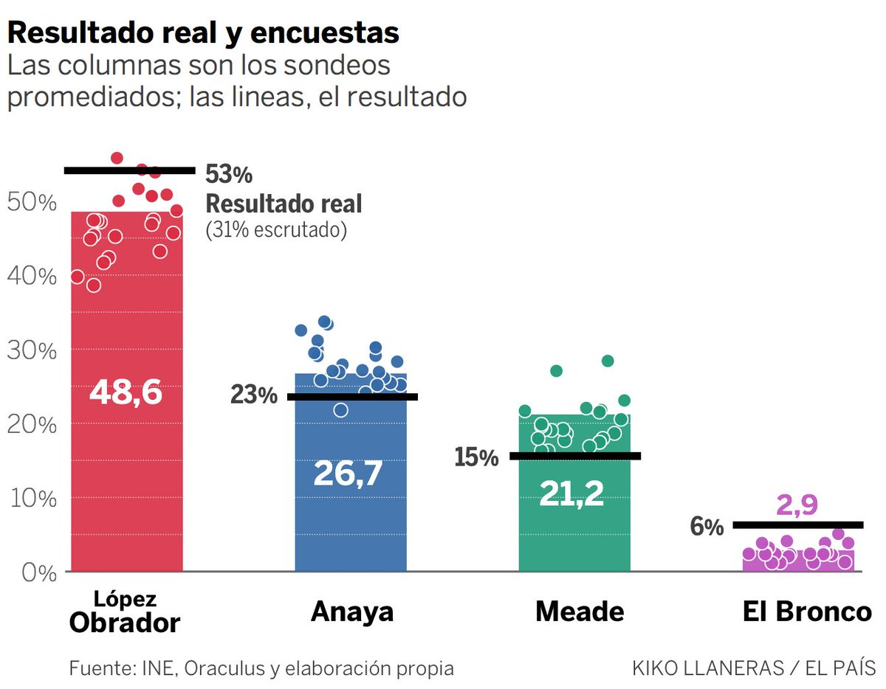
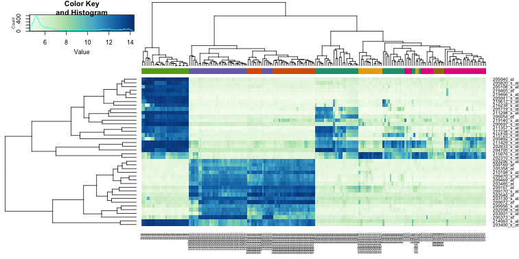
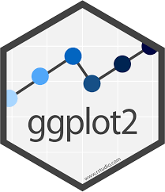

# First: install ggplot2


```{r eval=FALSE, tidy=FALSE, message=F, warning=F}
install.packages("ggplot2")
library("ggplot2")
```
<br/>

# Even better: install the set of packages tidyverse
```{r eval=FALSE, tidy=FALSE, message=F}
install.packages("tidyverse")
library("tidyverse")
```

Includes: ggplot2, dplyr, tidyr, ...

```{r eval=T, echo=FALSE, results="hide", message=F, warning=F}
library("tidyverse")
```


---
# Let's work

Open a dataset:
```{r, eval=F}
install.packages("gapminder")
library("gapminder")
```
```{r, echo=F}
library("gapminder")
```

Socio-economic dataset:
```{r}
head(gapminder)
```

---
# A histogram in R Base

```{r, out.width='60%', fig.asp = 0.7}
hist(gapminder$lifeExp, col="lightblue", main="", xlab="Life Exp")
```

---
# A histogram in ggplot2

```{r, out.width='60%', fig.asp = 0.7, message=F}
ggplot(gapminder, aes(lifeExp))+geom_histogram(fill="lightblue")+labs(title="")
```

---
# A scatter plot in R Base

```{r, out.width='60%', fig.asp = 0.7}
plot(gapminder$gdpPercap, gapminder$lifeExp, main="", xlab="GDP", ylab="Life Exp")
```

---
# A scatter plot in ggplot2

```{r, out.width='60%', fig.asp = 0.7}
ggplot(gapminder, aes(gdpPercap,lifeExp))+geom_point()+labs(title="")
```

---
# So, why ggplot2?

### Based on The Grammar of Graphics

High-level approach

Breaks up graphs into modular logical pieces (semantic components)

Leland Wilkinson, 2005

(statistician and computer scientist at H2O.ai)

### The ggplot2 package

Implementation of the Grammar of Graphics for R 

Very flexible, with nice, informative and intuitive plots

Hadley Wickham, 2005

(statistician and chief scientist at RStudio)

---
# Syntax

```
ggplot(data = <DATA>) + 
  <GEOM_FUNCTION>(
     mapping = aes(<MAPPINGS>),
     stat = <STAT>, 
     position = <POSITION>
  ) +
  <COORDINATE_FUNCTION> +
  <FACET_FUNCTION>
```


<br/>

7 components, but mainly 3...

But so useful in practice: colors, legends, faceting, rendering, ...

---
# What is exactly ggplot2?

<br/>

> "It is a mapping of data variables to aesthetic attributes of geometric objects" 

<br/>
<br/>

Three essential components:

- data: *dataframe* with data that we map
- aes: aesthetic attributes (x/y position, color, shape, size, ...)
- geom: the geometric object (points, lines, bars, ...) we want to plot


---
# Let's understand how ggplot2 works

```{r}
plot = ggplot(gapminder, aes(x = gdpPercap, y = lifeExp))
```

Nothing happens...

---
# Let's understand how ggplot2 works

```{r, fig.asp = 0.7, out.width='60%'}
plot + geom_point()
```

---
# Let's understand how ggplot2 works

```{r, fig.asp = 0.6, out.width='60%'}
ggplot(gapminder, aes(x = gdpPercap, y = lifeExp, color = continent)) + geom_point() 
```

---
# Let's understand how ggplot2 works

```{r, fig.asp = 0.6, out.width='60%'}
ggplot(gapminder, aes(x = gdpPercap, y = lifeExp, color = continent)) + geom_point() + 
  scale_x_log10() #<<
```

---
# Let's understand how ggplot2 works

```{r, fig.asp = 0.6, out.width='60%'}
ggplot(gapminder, aes(x = gdpPercap, y = lifeExp, color = continent)) + geom_point() + 
  scale_x_log10() + theme_minimal() + theme(legend.position="bottom") #<<
```


---
# Let's understand how ggplot2 works

Combine layers:

```{r, eval=F}
ggplot(gapminder, aes(x = gdpPercap, y = lifeExp, color = continent, size = pop)) +
  geom_point(alpha=0.5) + theme_minimal() + theme(legend.position="bottom") +
  scale_x_log10(breaks = c(300, 1e3, 3e3, 10e3, 30e3)) + 
  labs(title = "Gapminder and ggplot2",
       x = "Gross Domestic Product (log scale)",
       y = "Life Expectancy at birth (years)",
       color = "Continent", size = "Population") #<<
```

In that way, 4D information in a 2D plot...

---
# Let's understand how ggplot2 works

```{r, fig.asp = 0.5, out.width='80%', echo=F}
ggplot(gapminder, aes(x = gdpPercap, y = lifeExp, color = continent, size = pop)) +
  geom_point(alpha=0.5) + theme_minimal() + theme(legend.position="bottom") +
  scale_x_log10(breaks = c(300, 1e3, 3e3, 10e3, 30e3)) + 
  labs(title = "Gapminder and ggplot2",
       x = "Gross Domestic Product (log scale)",
       y = "Life Expectancy at birth (years)",
       color = "Continent", size = "Population")
```

---
# Some simple statistical models
```{r, fig.asp = 0.6, out.width='70%', message=F, warning=F}
ggplot(gapminder, aes(x = gdpPercap, y = lifeExp)) + geom_point() + geom_smooth() 
```

---
# Let's try bar plots

```{r, fig.asp = 0.6, out.width='70%'}
ggplot(gapminder, aes(x=reorder(continent, continent, length)))+geom_bar(aes(fill=continent))
```

---
# Let's try bar plots with polar coordinates

```{r, fig.asp = 0.6, out.width='70%'}
ggplot(gapminder, aes(x=reorder(continent, continent, length)))+geom_bar(aes(fill=continent))+
  coord_polar() #<<
```

---
## The syntax is the same!

### Just change the geom function or add more pieces (layers)...

# Let's try boxplots

```{r, eval=F, echo = T}
ggplot(gapminder, aes(x = continent, y = lifeExp)) +
  geom_boxplot(fill="lightblue", outlier.colour = "hotpink") + #<<
  geom_jitter(position = position_jitter(width = 0.1, height = 0), alpha = 1/4)
```

---
# Boxplots

```{r, fig.asp = 0.5, echo = FALSE, out.width='80%'}
ggplot(gapminder, aes(x = continent, y = lifeExp)) +
  geom_boxplot(fill="lightblue", outlier.colour = "hotpink") +
  geom_jitter(position = position_jitter(width = 0.1, height = 0), alpha = 1/4)
```

---
# Densities (and formulas)

```{r, fig.asp = 0.5, out.width='80%'}
ggplot(gapminder,aes(lifeExp))+geom_density(aes(group=continent,colour=continent,fill=continent),alpha=0.1) +
  annotate("text", x = 38, y = 0.09, parse = TRUE, size = 8, label = "y==frac(1, sqrt(2*pi)) * e^{-x^2/2}") 
```

---
# Time Series

```{r, eval=F}
gapminder %>%
  mutate(gdp=gdpPercap*pop) %>%
  group_by(continent,year) %>%
  summarize(MeanLifeExp=mean(lifeExp), MeanGDP=mean(gdp)) %>%
  ggplot(aes(year,MeanGDP,color=continent)) + 
  geom_line() #<<
```

---
# Time Series

```{r, fig.asp = 0.5, out.width='80%',echo=F}
gapminder %>%
  mutate(gdp=gdpPercap*pop) %>%
  group_by(continent,year) %>%
  summarize(MeanLifeExp=mean(lifeExp), MeanGDP=mean(gdp)) %>%
  ggplot(aes(year,MeanGDP,color=continent)) + 
  geom_line()
```


---
# Facets

```{r, eval=F}
ggplot(gapminder, aes(gdpPercap, lifeExp, group=continent, color=year, size=pop)) + 
  geom_point() + 
  facet_wrap(~ continent) + #<<
  scale_color_gradient(low="red", high="green") +
  theme_minimal()+ theme(legend.position="bottom") 
```

---
# Facets

```{r, fig.asp = 0.6, out.width='70%',echo=F}
ggplot(gapminder, aes(gdpPercap, lifeExp, group=continent, color=year, size=pop)) + 
  geom_point() + 
  facet_wrap(~ continent) +
  scale_color_gradient(low="red", high="green") +
  theme_minimal()+ theme(legend.position="bottom") 

```

---
# Themes and text

```{r, eval=F}
gapminder %>% filter(year==2007) %>%
  ggplot(aes(x = gdpPercap, y = lifeExp, color = continent, size = pop, label = country)) +
  geom_text() + #<<
  # clean the axes names and breaks
  scale_x_log10(limits = c(200, 60000)) +
  labs(title = "GDP versus life expectancy in 2007",
       x = "GDP per capita (log scale)",
       y = "Life expectancy") +
  # add a nicer theme
  theme_classic() + theme(legend.position="none") #<<
```

---
# Themes and text

```{r, fig.asp = 0.6, out.width='80%',echo=F}
gapminder %>% filter(year==2007) %>%
  ggplot(aes(x = gdpPercap, y = lifeExp, color = continent, size = pop, label = country)) +
  geom_text() +
  # clean the axes names and breaks
  scale_x_log10(limits = c(200, 60000)) +
  labs(title = "GDP versus life expectancy in 2007",
       x = "GDP per capita (log scale)",
       y = "Life expectancy") +
  # add a nicer theme
  theme_classic() + theme(legend.position="none")
```

---
# Correlations

```{r, fig.asp = 0.5, out.width='80%', message=F, warning=F}
library(GGally)
ggcorr(gapminder[,3:6], label = T)
```

---
# Animations

```{r, eval=F}
install.packages("gifski")
library(gganimate)

gapminder %>%
  ggplot(aes(gdpPercap, lifeExp, size = pop, colour = continent)) +
  geom_point(alpha = 0.4) +
   geom_text(aes(x = gdpPercap, y = lifeExp + 2, label = country), size=4,
            data = filter(gapminder, country %in% c("Spain"))) +
  scale_x_log10(limits = c(200, 60000)) +
  theme_light() + theme(legend.position = 'bottom') +
  labs(title = 'Year: {frame_time}', x = 'GDP per capita (log)', y = 'Life expectancy') +
  transition_time(year) + #<<
  ease_aes('linear')  #<<
```

```{r, eval=T, echo=F}
library(gganimate)
```

We are going to plot 5D information in a 2D plot...


```{r, message=F, warnings=F, fig.asp = 0.7, out.width='70%',echo=F}

# gapminder %>%
#   ggplot(aes(gdpPercap, lifeExp, size = pop, colour = continent)) +
#   geom_point(alpha = 0.4) +
#    geom_text(aes(x = gdpPercap, y = lifeExp + 2, label = country), size=4,
#             data = filter(gapminder, country %in% c("Spain"))) +
#   scale_x_log10(limits = c(200, 60000)) +
#   theme_light() + theme(legend.position = 'bottom') +
#   labs(title = 'Year: {frame_time}', x = 'GDP per capita (log)', y = 'Life expectancy') +
#   transition_time(year) +
#   ease_aes('linear')   
  
```

---
class: center, middle


---
# A little practice and you'll get...



---
# A little practice and you'll get...

Edward Tufte's book: Visual Display of Quantitative Information


---
# A little practice and you'll get...

Publication-ready plots



---
# A little practice and you'll get...

Ask the Question, Visualize the Answer (Flowing Data)


---
# Final comments

- Input for ggplot2 must be a data.frame

- But there are shortcuts to avoid creating data frames, like qplot

- Easy to save: ggsave("myplot.png")

- Many themes to get different looks to your plots

- Many packages based on ggplot2: factoextra, GGally, gganimate, ...

- It can be integrated in interactive graphics: shyny, ggvis, etc.

<br/>
No excuses: use ggplot2 in your teaching, talks, publications, ...

<br/>
<br/>

> "The purpose of visualization is insight, not pictures" --- Ben Shneiderman

---
# More resources

The main website:
http://ggplot2.tidyverse.org/

The book: ggplot2 (Elegant Graphics for Data Analysis), by Hadley Wickham
https://www.springer.com/us/book/9780387981413

The cheat sheet:
https://www.rstudio.com/wp-content/uploads/2015/03/ggplot2-cheatsheet.pdf

The R Graph Gallery:
http://r-statistics.co/Top50-Ggplot2-Visualizations-MasterList-R-Code.html

Top 50 ggplot2 Visualizations
http://r-statistics.co/Top50-Ggplot2-Visualizations-MasterList-R-Code.html

Getting help (RStudio community)
https://community.rstudio.com

Getting help (stack overflow)
https://stackoverflow.com/questions/tagged/ggplot2


---
background-image: url("2019-03-05_files/img/uc3m.jpg")
background-position: 90% 90%
background-size: 60%


# Thanks

<br/>


###  [**Coding Club**](https://codingclubuc3m.github.io) UC3M

###  ggplot2 is a part of the [**tidyverse**](https://ggplot2.tidyverse.org) ecosystem

###  Slides created via the R package [**xaringan**](https://github.com/yihui/xaringan)
